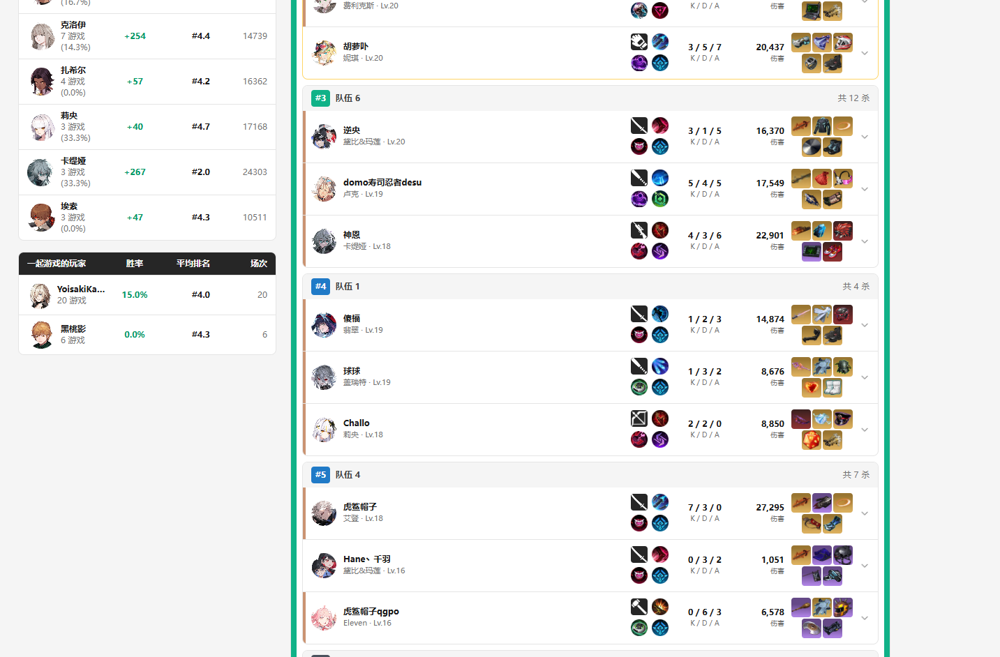
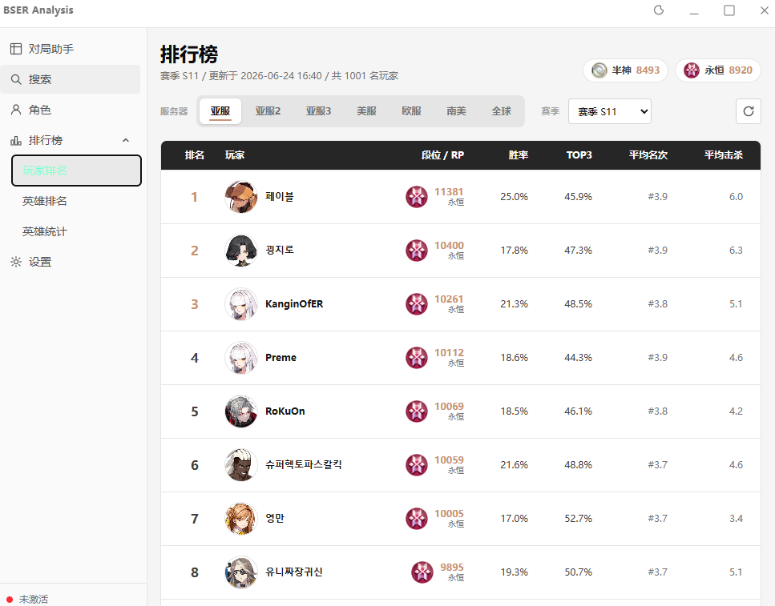
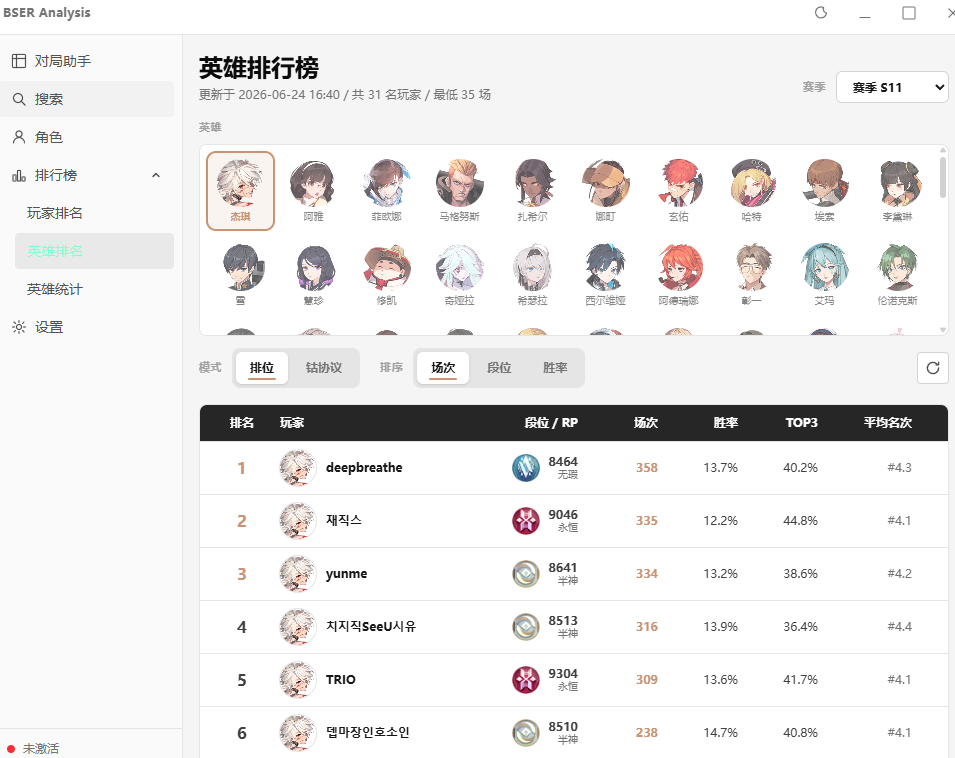
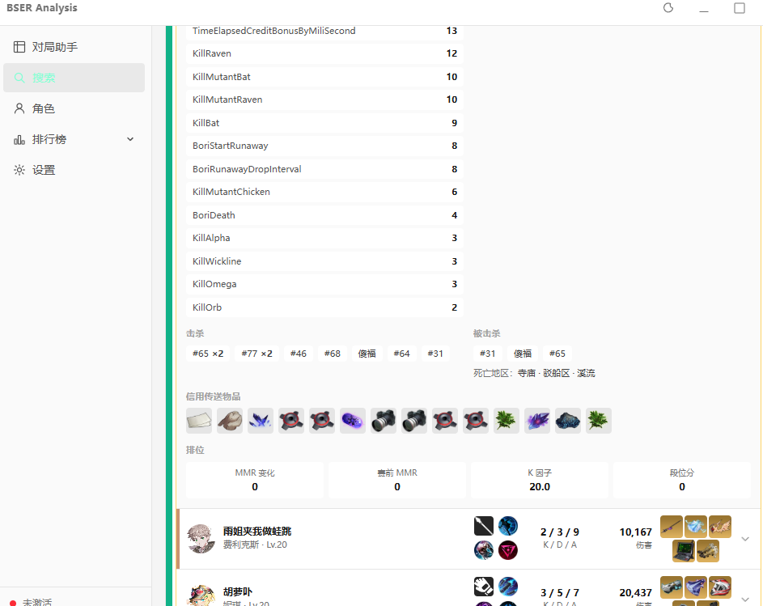
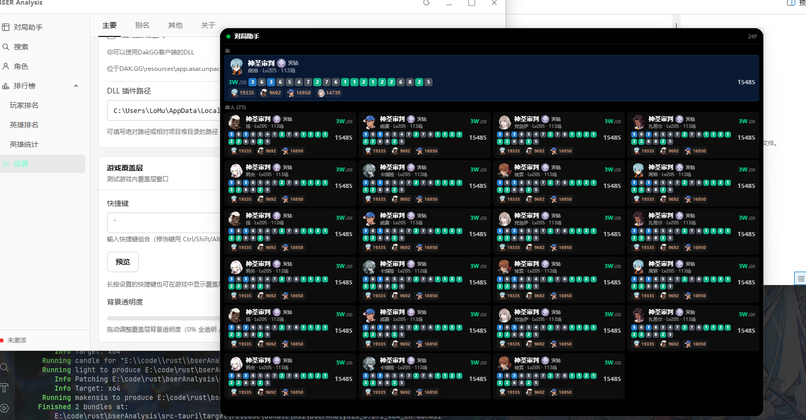

# bserAnalysis

永恒轮回(Eternal Return) 游戏数据分析工具，基于 **Tauri v2 + React 19 + TypeScript** 构建。  
数据源来自 [dak.gg](https://dak.gg/er)，非完全复刻，实现了常用的查询与分析功能。

## 功能截图

### 玩家搜索
支持按昵称搜索玩家档案、查看排位数据、常用英雄、近期对局详情与双人对比。




### 排行榜
全球/各服务器排行榜，查看玩家 RP 段位与涨跌。




### 角色分析
角色详情页包含武器流派、技能顺序、出装推荐、潜能选择与高分玩家。




### 游戏内覆盖层
注入游戏进程后，长按快捷键可叠层显示对局内所有玩家的段位、常用英雄与近期战绩。



---

## 技术栈

| 层 | 技术                                      |
|---|-----------------------------------------|
| 桌面框架 | Tauri v2                                |
| 前端 | React 19 + TypeScript + Jotai + Tailwind CSS |
| 后端 | Rust + Tokio + Reqwest                  |
| 游戏注入 | 使用Dak.gg客户端DLL注入(与Dak.gg实现方法完全相同)       |

## 开发

```bash
npm install
npm run tauri dev     # 开发模式
npm run tauri build   # 生产构建
```

## 许可

AGPL-3.0 license
